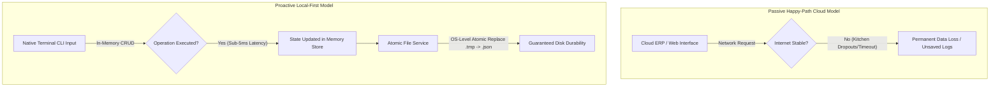

# 🥖 **EstocaPão — Eliminating Inventory Friction & Revenue Leakage**

### **High-Performance In-Memory Local CLI Inventory Engine for Artisanal Bakeries**

[](https://www.python.org/)
[](<https://en.wikipedia.org/wiki/Hexagonal_architecture_(software)>)
[](https://peps.python.org/pep-0008/)
[](https://en.wikipedia.org/wiki/Test-driven_development)
[](https://peps.python.org/pep-0008/)
[](https://img.shields.io/badge/Platform-Windows%20%7C%20Linux%20%7C%20macOS-lightgrey?style=for-the-badge)

---

## **🏛️ Repository Metadata & Context**

| Property               | Description                                                                   |
| :--------------------- | :---------------------------------------------------------------------------- |
| **Role**               | Core Repository Architecture / Project Lead                                   |
| **Target Segment**     | Artisanal Bakeries (Boulangeries, Pastry Shops, and Specialty Micro-Bakeries) |
| **Architecture Style** | Hexagonal Architecture (Ports & Adapters) / Domain-Driven Design (DDD)        |
| **Execution Engine**   | In-Memory RAM Database with Atomic Fallback Disk Serialization                |
| **Date of Creation**   | June 12, 2026                                                                 |
| **Current Version**    | v1.0.0                                                                        |

---

## **🚀 1. The Product Vision & Core Problem**

### **1.1. The Macro Pain Space**

Most traditional inventory platforms operate under a cloud-first premise, assuming that continuous internet connection, external webhooks, and complex client-server handshakes are structurally flawless.

In real-world artisanal kitchen environments, flour dust, water exposure, and low connectivity dropouts introduce severe operational barriers. Relying on paper logs or bloated, network-dependent ERP systems leads to systematic data loss, inaccurate stock counts during late-night shift handovers, and catastrophic early-morning stockouts of critical ingredients (e.g., specialty yeast, organic flours). This results in direct capital loss, margin erosion through emergency retail procurements, and acute operational anxiety for bakery owners.

### **1.2. The EstocaPão Paradigm Shift**

EstocaPão transitions from passive data ingestion to **Proactive Systemic Resilience** by running completely local-first and offline. Instead of relying on slow network-bound databases, the system handles operations entirely in-memory using dynamic dictionary hash maps and safeguards data durability through a synchronized serialization backup engine.



> [!IMPORTANT]
> **Performance Constraint:** To guarantee business integrity and lightning-fast inputs matching a closing shift, EstocaPão implements an execution window bound by the following operational constraint: **All memory-resident lookups, updates, and state mutations maintain strict $O(1)$ complexity and execute under 5 milliseconds.**

---

## **🎮 2. CLI Usage Reference**

The terminal client is engineered for keyboard-only efficiency, optimized for rapid numeric keypad typing by kitchen staff during fast-paced shift handovers. Once installed, use the following commands:

| Command                  | Syntax                                                        | Description                                                                           | Example                                                           |
| :----------------------- | :------------------------------------------------------------ | :------------------------------------------------------------------------------------ | :---------------------------------------------------------------- |
| **Initialize System**    | `estocapao --init`                                            | Bootstraps configuration files, logs, and initial JSON databases.                     | `python src/main.py --init`                                       |
| **Check Stock Status**   | `estocapao status`                                            | Renders a high-contrast stock list, flagging low levels and quarantine items.         | `python src/main.py status`                                       |
| **Add Ingredient Lot**   | `estocapao add <name> <qty> --exp <date> --limit <threshold>` | Registers a new ingredient lot with an expiration date and low-stock alert threshold. | `python src/main.py add flour 25.5 --exp 2026-07-20 --limit 15.0` |
| **Consume / Update**     | `estocapao update <id> <qty>`                                 | Increments or decrements (if quantity is negative) active stock levels in-memory.     | `python src/main.py update flour -5.2`                            |
| **Discard / Quarantine** | `estocapao discard <batch_id>`                                | Safely removes or quarantines a contaminated or damaged batch from available stock.   | `python src/main.py discard FL-001`                               |

> [!NOTE]
> **Data Rules:**
>
> - Ingredient IDs are alphanumeric, case-insensitive, and cleaned of leading/trailing spaces.
> - Expiration dates must follow standard ISO formats (`YYYY-MM-DD`).
> - Input quantities are checked for numeric bounds at the parser level to prevent system trace crashes.

---

## **🗺️ 3. Repository Context Map**

This codebase represents a highly documented software engineering project. Navigating through the architectural and business definitions can be done via the following localized resources:

- 🔍 [Product Discovery Document](file:///e:/Desenvolvimento%20de%20Software/Software%20Engineering%20Portfolio/01-programacao/EstocaP%C3%A3o/context/Product%20Discovery%20Document-%20EstocaP%C3%A3o.md) — Exhaustive user interviews, persona mappings, target audience pain points, and functional requirements definition.
- 🏗️ [Software Design Document](file:///e:/Desenvolvimento%20de%20Software/Software%20Engineering%20Portfolio/01-programacao/EstocaP%C3%A3o/context/Software%20Design%20Document%20-%20EstocaP%C3%A3o.md) — Comprehensive technical blueprints, class diagrams, database schemas, security architectures, and Architecture Decision Records (ADRs).
- 🏛️ [Solution Architecture Document](file:///e:/Desenvolvimento%20de%20Software/Software%20Engineering%20Portfolio/01-programacao/EstocaP%C3%A3o/context/Solution%20Architecture%20Document%20-%20EstocaP%C3%A3o.md) — Structural diagrams, C4 deployment models, OS-level permission controls, and resilience mechanics.
- 📋 [Backlog Board README](file:///e:/Desenvolvimento%20de%20Software/Software%20Engineering%20Portfolio/01-programacao/EstocaP%C3%A3o/context/backlog/README.md) — Agile Kanban board managing atomic, SMART tasks prioritized through the RICE estimation framework.
- 📝 [Execution Plan](file:///e:/Desenvolvimento%20de%20Software/Software%20Engineering%20Portfolio/01-programacao/EstocaP%C3%A3o/context/Execution%20Plan%20-%20EstocaP%C3%A3o.md) — Systematic build phases, integration checkpoints, and automated boundary verification rules.

---

## **🚦 4. Implementation Phase Checklist**

Progress of the EstocaPão system foundation is tracked directly through the development roadmap:

- [x] **Phase 0: Project Setup** — Workspace directories established, PEP 8 linter set, and CLAUDE.md developer guide generated.
- [ ] **Phase 1: Pure Domain Layer** — Building `BatchValueObject` and `IngredientEntity` with strict stock invariants (TDD core).
- [ ] **Phase 2: Use Case Interactors** — Orchestration for `UpdateStock`, `GetInventoryStatus`, and logical quarantine routing.
- [ ] **Phase 3: Configurations & Permissions** — Custom configuration parsers, database scheme validations, and OS-level file locking.
- [ ] **Phase 4: Persistence Layer** — Json persistence adapters implementing atomic swap writes (`db_backup.tmp` ➔ `os.replace`).
- [ ] **Phase 5: CLI Routing & Logs** — Standard `argparse` controllers, high-contrast ANSI logs, and system logging to `estocapao.log`.
- [ ] **Phase 6: Distribution Packaging** — Executable command packaging via `pyproject.toml` enabling global `estocapao` command.

---

## **🛠️ 5. Technical Stack Overview**

The engineering blueprint balances ultra-low execution latency, zero external runtime overhead, and absolute offline durability on legacy kitchen hardware.

- **Frontend Client / CLI Engine**
  - _Technology:_ Native OS Terminal Shell (`argparse` Engine)
  - _Rationale:_ Keyboard-driven, high-contrast CLI optimized for rapid typing by kitchen staff with flour-dusted hands.
- **Backend Application Core**
  - _Technology:_ Python 3.10+ Standard Library (Pure OOP)
  - _Rationale:_ Zero-dependency application layer ensuring immediate application boot times under 200ms without environment pollution.
- **Data Interception & Integrity Layer**
  - _Technology:_ Regex & Datetime Validation Pipeline
  - _Rationale:_ Intercepts raw input streams, enforces strict ISO date formats, and systematically blocks negative values at the parser level.
- **In-Memory Storage Engine**
  - _Technology:_ Memory-Resident Hash Maps (Python Native Dictionaries)
  - _Rationale:_ Bypasses traditional disk-access bottlenecks to ensure rapid interaction loops during fast-paced handovers.
- **Fallback Persistence Layer**
  - _Technology:_ Local Filesystem Metadata Serialization (`json` & `configparser`)
  - _Rationale:_ Manages system threshold parameters via `config.ini` and flushes state changes safely into `db_backup.json` using an atomic file-replacement pattern.

---

## **🏗️ 6. Core Architectural Premises**

To scale cleanly and maintain absolute quality gates, the application enforces Clean Architecture guidelines paired with strategic domain boundaries:

- **Strict Domain Isolation:** The codebase is decoupled using Clean Architecture layers. The domain layer contains pure business entities completely isolated from infrastructure, terminal parsing, or file I/O operations.
- **TDD-First Enforcement:** Every code routine must strictly follow the Red-Green-Refactor cycle. Functional business behaviors require failing automated test specifications (subclassing `unittest.TestCase`) before production code can be written.
- **Logical Expiration Quarantine:** To protect food safety without compromising inventory visibility, expired ingredients are never deleted automatically. The system flags and moves expired batches into a logical "Quarantine Queue," forcing an explicit confirmation before writing off inventory waste.
- **Safe Atomic Serialization:** To eliminate file corruption risks from sudden power cuts, data is written using a temporary swap file pattern. The persistence adapter serializes data to `db_backup.tmp` first, then performs an instant operating system-level rename (`os.replace`) to overwrite `db_backup.json`.

---

## **📂 7. Codebase Structure & Directory Standards**

```text
estocapao-root/
├── src/                          # System codebase root directory
│   ├── estocapao/                # Primary application context package
│   │   ├── __init__.py           # Application entry definition
│   │   ├── bootstrap/            # Application bootstrap controller
│   │   │   └── initializer.py    # Configures dependency injection mappings
│   │   │
│   │   ├── modules/              # Subsystem domains & bounded contexts
│   │   │   └── inventory/        # Primary inventory module
│   │   │       ├── domain/       # Core business logic (entities, value objects, ports)
│   │   │       │   ├── entity.py # IngredientEntity logic
│   │   │       │   ├── value.py  # BatchValueObject logic
│   │   │       │   └── ports.py  # Outbound interfaces (IInventoryRepository)
│   │   │       │
│   │   │       ├── app/          # Application layer (business use cases)
│   │   │       │   └── usecase.py# UpdateStock, GetInventory use cases
│   │   │       │
│   │   │       └── infra/        # Adaptation layer (file systems, terminal integrations)
│   │   │           ├── cli.py    # CommandLineInterfaceParser logic
│   │   │           └── repo.py   # LocalJsonRepositoryAdapter logic
│   │   │
│   │   └── shared/               # Globally accessible application resources
│   │       ├── ansi.py           # ANSI color definitions for output layouts
│   │       └── logger.py         # Appends actions to estocapao.log
│   │
│   └── main.py                   # Process starter executing CLI commands
│
├── tests/                        # Validation suite directory
│   ├── unit/                     # Validates domain rules and assertions
│   ├── integration/              # Verifies atomic local disk operations
│   └── e2e/                      # Runs real process shell loop tests
│
├── pyproject.toml                # Standard setuptools configuration file
├── config.ini                    # Core parameter configurations
└── README.md                     # Initial setup instructions and documentation
```

---

## **💻 8. Local Engineering Development Setup**

### **8.1. Core System Prerequisites**

- Python 3.10+ Environment (Strictly utilizing Python Standard Libraries).
- Sufficient operating system permissions to read/write files locally within the program directory.
- A standard terminal shell environment supporting ANSI escape codes.

### **8.2. Initial Bootstrap Sequence**

1. Clone this repository locally to your local development workspace:
   ```bash
   git clone https://github.com/your-org/estocapao.git
   cd estocapao
   ```
2. Bootstrap the configuration files and initial environment paths:
   ```bash
   python src/main.py --init
   ```
3. Launch the interactive CLI to check current stock status and active system alert flags:
   ```bash
   python src/main.py status
   ```
4. Update or append an active bakery ingredient batch directly from the terminal:
   ```bash
   python src/main.py update flour 15.0 --exp "2026-07-20"
   ```

### **8.3. Automated Verification Commands**

Ensure your modifications pass the repository quality gates before submitting a Pull Request:

- **Execute full testing matrix (Unit, Integration, and E2E)**:
  ```bash
  python -m unittest discover -s tests
  ```
- **Verify Clean Architecture import guardrails**:
  ```bash
  python scripts/verify_boundaries.py
  ```

---

🏁 **End of Document:** This repository README serves as the definitive engineering portal for the EstocaPão ecosystem. Changes to core validation patterns, database fallback structures, or execution interfaces must comply with official pull-request governance.

---

Feito com ❤️ por **Kalyel N. | Software Developer**
