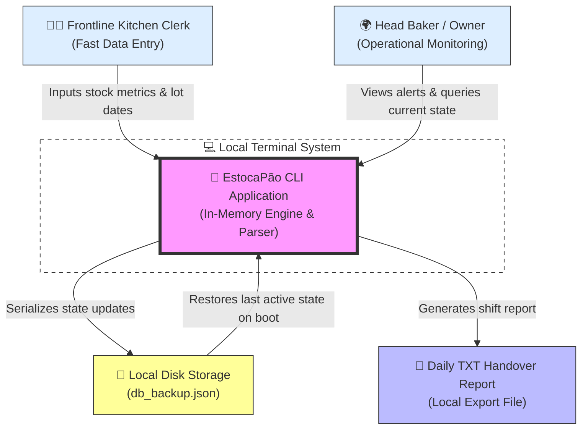

# **📋 Solution Architecture Document: EstocaPão — Eliminating Inventory Friction & Revenue Leakage**

**Role:** Product Owner / Solution Architect

**Objective:** Define the strategic, commercial, and technical blueprint for resolving the core problem space mapped during discovery.

**Context:** EstocaPão — A performance-oriented, local-first Command Line Interface (CLI) inventory management application designed to eliminate human error and stockouts in artisanal bakeries through high-speed, memory-resident CRUD operations and rigorous input-validation pipelines.

## **🏛️ Project Metadata**

- **Client / Segment:** Artisanal Bakeries (Boulangeries, Pastry Shops, and Specialty Micro-Bakeries)
- **Date of Creation:** June 12, 2026
- **Lead Product Owner:** Kalyel Nunes Laurindo / PO
- **Document Version:** v1.0

## **🚀 1. The Market Opportunity & Strategic Positioning**

In the fast-paced environment of artisanal bakeries, inventory is the engine of daily revenue. Yet, the vast majority of small to mid-sized bakeries run on offline grease-stained paper logs, leading to massive financial waste and supply chain uncertainty. EstocaPão addresses this operational friction head-on by replacing "gambiarras" (makeshift workarounds) with a robust, zero-configuration local CLI utility that guarantees total operational control and accuracy for the frontline kitchen crew.

### **1.1. Market Size & Opportunity Map (TAM / SAM / SOM)**

Backed by industry data from the Brazilian Association of the Bread and Bakery Industry (ABIP) and ITPC (2025/2026 tracking), the target market is structured as follows:

- **Total Addressable Market (TAM):** \~179,000 active bakeries and confectioneries across Brazil, representing a foodservice transaction pool of over R$ 178 Billion annually. Any establishment using perishable inventory is a potential candidate.
- **Serviceable Addressable Market (SAM):** \~42,000 formally registered traditional independent bakeries and specialized "Boulangeries/Pastry Shops" with low-tech tolerance, requiring ultra-lightweight, zero-overhead offline tools rather than expensive, bloated ERP systems.
- **Serviceable Obtainable Market (SOM):** 500 regional artisanal bakeries within Year 1. This target focuses on tech-transitioning bakeries aiming to immediately cut down their $3,150.00/month average Cost of Inaction (COI) by adopting our free, zero-overhead local tool before graduating to complex cloud solutions.

### **1.2. Competitive Landscape & Product Moat**

To position EstocaPão for success, we analyze existing alternatives against our local-first, terminal-based value proposition:

- **Competitor A (Traditional Retail ERPs):** Generic inventory software (e.g., MarketUp, VHSYS).
  - _The Gap / Friction Point:_ High setup friction, steep learning curve, require reliable internet connectivity (unusable in wet, underground, or remote kitchen environments), and lack specific baking workflow features (like easy lot expiration tracking).
  - _Our Advantage:_ Zero boot-up latency, completely offline operation, and keyboard-driven lightning-fast inputs matching the speed of a closing shift.
- **Competitor B (Mobile Inventory Apps):** Cloud-connected smartphone inventory managers.
  - _The Gap / Friction Point:_ Kitchen staff have their hands covered in flour, grease, or dough, making small touchscreen keyboards highly error-prone and frustrating to operate during fast-paced shift handovers.
  - _Our Advantage:_ Large physical keyboards on desktop/terminal stations, optimized for rapid numeric keypad typing with instant input validation feedback.
- **Manual Workarounds (The "Status Quo"):** The "Nail & Clipboard" Wall Log & the "We're Out!" WhatsApp Group Chat.
  - _The Gap / Friction Point:_ Absolute lack of data durability, zero structural validation (clerks entering illegible quantities), high operational error rates, and zero predictive analytics for low stock.
  - _Our Advantage:_ Standardized data structures, mandatory real-time CLI field validations, automatic warning flags for expired or low-stock ingredients, and automatic local JSON persistence.

## **⚖️ 2. Licensing, Open-Source & Distribution Model**

As a local-first, privacy-respecting portfolio utility, EstocaPão is structured as a completely **Free & Open-Source Software (FOSS)** application to ensure zero operational barriers for small and family-owned artisanal bakeries:

- **Permissive Open-Source License (MIT License):**
  - The codebase is licensed under the MIT License, guaranteeing absolute freedom for users and developers to run, modify, distribute, and adapt the software without any licensing fees, subscription costs, or vendor lock-in.
- **Zero-Cost Local-First Ethos:**
  - **Software Cost:** $0.00/month (completely free). All core features—including unlimited ingredient tracking, automated local backups, warnings, and daily handover reports—are unlocked out of the box.
  - **Community Distribution:** Distributed directly via GitHub and PyPI (Python Package Index) for simple, zero-configuration local installation via `pip`.
- **Community-Driven Support & Self-Hosting:**
  - Self-hosted documentation and a step-by-step setup guide allow tech-conscious bakery owners (or local IT volunteers) to deploy the tool on legacy PCs or low-cost hardware (e.g., Raspberry Pi) in under 15 minutes, completely avoiding any implementation fee.

## **🛠️ 3. Technical Viability & High-Level Architectural Vision**

To deliver a high-performance system under strict operational constraints, EstocaPão leverages key software engineering design patterns to address system challenges:

- **Challenge 1: High-Speed Operational Input & Zero Latency** \* _Architectural Solution:_ Entirely memory-resident inventory structures (implemented via Python dictionary hash maps). This guarantees O(1) lookup and write complexity, ensuring operations take less than 5 milliseconds, far outpacing network-bound database queries.
- Challenge 2: Preventing Data Loss on **Terminal Crash or Exit (State Durability)** \* _Architectural Solution:_ A local-first persistence engine utilizing a synchronized serialization pipeline. Every write operation triggers an asynchronous local append-only JSON file write (db_backup.json), acting as a durability fallback that restores state instantly upon application boot.
- **Challenge 3: Multi-Platform Execution on Legacy Kitchen Hardware** \* _Architectural Solution:_ A native Python cross-platform package wrapping the terminal UI. It operates seamlessly on legacy PCs, inexpensive single-board devices (like Raspberry Pi), or modern macOS/Windows laptops, avoiding the need for dedicated IT infrastructure.
- **Challenge 4: High Margin of Human Error During Late-Night Handovers** \* _Architectural Solution:_ A strict multi-layered regex and datetime validation pipeline. All CLI inputs are intercepted at the parser level before committing to the memory state, immediately flashing error messages and auto-correcting trailing spaces.

### **3.1. Core Architectural Premises**

- **Decoupling Configuration from Core CLI Engine:** Low-stock threshold triggers and expiration danger windows are decoupled into a simple, editable configuration file (config.ini), allowing bakery managers to modify system rules without changing Python source code.
- **Logical Expiration Gatekeeper (Human-In-The-Loop):** The CLI prevents automatic deletion of expired stock. Instead, it moves expired items to a designated "Quarantine Queue," forcing the head baker to perform a physical confirmation before permanently writing off the waste.
- Local-First, **Privacy-by-Default:** No client, ingredient, or financial data ever leaves the local terminal, ensuring absolute business confidentiality and immediate compliance with data privacy expectations.

## **📑 4. Requirements Engineering & Feature Specification**

Based on Scenario-Based Requirements Engineering (SBRE) and MoSCoW prioritization, the system specifications map directly to the bakery's real-world operational journey.

### **🎭 4.1. Scenario-Based Requirements Engineering (SBRE)**

- Scenario A **(Clerk Shift Closing Inventory Entry):** \* _Trigger:_ The shift ends at 10:00 PM; the clerk opens the CLI terminal and types estocapao update flour 15 --exp "2026-07-20".
  - _System Action:_ The system validates the date format, verifies that the quantity is a positive float, updates the memory map, commits the record to db_backup.json, and outputs a successful update message with a confirmation green badge.
- **Scenario B (Early Morning Shortage Check):** \* _Trigger:_ The Head Baker logs in at 3:00 AM to begin dough preparation and boots the terminal.
  - _System Action:_ On boot, the CLI automatically parses all active batches, detects that yeast has fallen below the 5kg safety threshold, and flashes a bright red warning prompt: [WARN] CRITICAL LOW STOCK: Yeast (Remaining: 2.1kg | Threshold: 5.0kg).
- Scenario C (Lot Expiration Detection): \* _Trigger:_ The chef attempts to retrieve a dairy batch that has crossed its shelf-life expiration date.
  - _System Action:_ The CLI terminal intercepts any action on that specific lot and prompts: [ALERT] Butter Lot #402 expired on 2026-06-11! Item moved to quarantine. Discard manually? [y/N].
- **Scenario D (Accidental Terminal Interrupt):** \* _Trigger:_ A clerk accidentally closes the CLI or pulls the power plug during a transaction write.
  - _System Action:_ On reboot, the application’s state engine parses db_backup.json, rebuilds the in-memory dictionary, and auto-heals any partial write records to prevent state corruption.

### **🎯 4.2. MoSCoW Prioritization Framework**

#### **🔴 Must Have (Critical for Core Value Proposition & MVP Launch)**

- **RF01: In-Memory CRUD Operations** \* _Description:_ Complete high-performance system to Create, Read, Update, and Delete ingredient states in dynamic dictionaries.
  - _JTBD Tracing:_ JTBD #1 - Operational Efficiency and accurate fast closures.
- **RF02: Rigid CLI Parser Validation Engine** \* _Description:_ Custom input interception blocking negative values, non-numeric strings, and parsing date formats systematically.
  - _JTBD Tracing:_ JTBD #2 - Error-free data entries under physical fatigue.
- RF03: **Real-Time Warning Alert Flags** \* _Description:_ Immediate console-level color warnings for expired inventory lots and ingredients breaching minimum thresholds.
  - _JTBD Tracing:_ JTBD #3 - Preventing early-morning stockout panic.
- RF04: Automatic JSON **Fallback Persistence** \* _Description:_ Seamless serialization of active memory states to local storage to survive crashes or restarts.
  - _JTBD Tracing:_ JTBD #1 - Data durability.

#### **🟡 Should Have (High Value, Target for Immediate Post-MVP Release)**

- **RF05: Automatic Daily Inventory Handover Report Generator** \* _Description:_ Exports current inventory, low-stock alerts, and expired losses into a formatted .txt or .csv report.
  - _JTBD Tracing:_ JTBD #4 - Ease of reporting to bakery ownership.
- **RF06: Auto-Suggested Batch Lot Numbers** \* _Description:_ Auto-calculates unique alphanumeric codes for new deliveries to trace vendor batches over time.
  - _JTBD Tracing:_ JTBD #5 - Traceability for food safety compliance.

#### **🟢 Could Have (Desirable, Nice-to-Have, Low Urgency)**

- **RF07: Multi-user Role Credentials** \* _Description:_ Extremely basic authentication (--user clerk / --user admin) to track which employee registered a stock discrepancy.
  - _JTBD Tracing:_ JTBD #6 - Shift accountability.

#### **⚪ Won't Have (Explicitly Out of Scope for MVP)**

- **RF08: Graphical User Interface (GUI) or Cloud Database Integration** \* _Description:_ Keeping the system 100% focused on memory-resident terminal operations to prevent scope and budget creep.

## **⚙️ 5. Non-Functional Requirements (NFRs)**

- **NFR01 (Performance & Latency):** Core lookup, retrieval, and write operations must run in O(1) time, taking less than 5ms per transaction to guarantee responsive interactive terminal loops.
- **NFR02 (Portability & OS Compatibility):** The system must execute cleanly on Python 3.10+ without OS-specific bindings, ensuring native cross-compatibility with Windows, macOS, and Linux terminal shells.
- NFR03 (Zero External **Dependencies):** To achieve a truly "plug-and-play" experience on limited-infrastructure hardware, the system must rely entirely on Python standard libraries (e.g., json, datetime, re, argparse), requiring no external packages or active internet setups.
- NFR04 (Availability & **Offline Resilience):** The system must achieve 100% functional availability offline, operating independently of any external server or API services.
- **NFR05 (Data Integrity Protection):** The backup JSON files must be structured with internal schema validations to reject corrupted read states on boot, falling back to the last stable state if corruption is detected.

## **📦 6. MVP Scope Boundary (Defining the Line in the Sand)**

### **6.1. Product Focus Area (MVP Scope)**

- **Target Segments:** Artisanal Boulangeries, pastry kitchens, and micro-baking workshops facing daily ingredient expiration risks.
- **Key Flows Included:** 1. Interactive fast-entry CLI flow for shift closures.  
  2. Boot-time automatic check flagging expired/low-stock inventory.  
  3. Automatic JSON local backup persistence.

### **6.2. Explicitly OUT of Scope (Post-MVP Backlog)**

- ❌ Persistent cloud relational/NoSQL database connections (e.g., PostgreSQL, Firebase).
- ❌ Graphical interface, mobile app wrappers, or touch-screen layouts.
- ❌ Direct Point of Sale (POS) register integrations, ticket printing, and financial ledger handling.
- ❌ Machine learning or AI-driven supplier replenishment automation.

## **🎯 7. Validation Strategy & Success Metrics**

### **7.1. North Star Metric**

Our primary measure of success representing real value to the customer:

"Daily inventory shift-closure time reduced from 60 minutes of **paper-log chaos to under 5 minutes of verified, error-free CLI input."**

### **7.2. Launch Gates & KPIs**

- **Operational Accuracy Rate:** 100% of inputs verified by the validation parser, reducing clerical error rates on handovers to absolute zero.
- Cost of **Inaction (COI) Reduction:** Achieve a target **$2,500.00/month reduction** in bakery overhead by eliminating margin erosion from retail emergency runs and unmonitored spoilage within the first 60 days of adoption.
- **Terminal Boot and Load Speed:** Launch time under 200ms, immediately ready for typing.

## **🎨 8. System Architecture Visualization**

### **8.1. System Context Diagram (Level 1)**

Displays how EstocaPão integrates into the physical bakery workspace, removing dependencies on cloud-centric databases or complex external web systems.

### **8.2. Container Diagram (Level 2)**

Explains how incoming user requests are parsed, validated, routed to in-memory models, and serialized locally.

```mermaid
graph TD
    UserCLI((Clerk/Baker Terminal Interface))

    subgraph Estocapa_o_CLI_Engine ["⚙️ EstocaPão Python Engine"]
        Parser[CLI Argparse Router / Interface Parser]
        Validator[Regex & Expiration Datetime Validator]
        StateEngine[In-Memory Business Logic & State Controller]
        MemoryStore[In-Memory Hash Map / State Dictionary]
        BackupService[JSON Serialization & Auto-Recovery Worker]
    end

    subgraph Local_FileSystem_Layer ["📂 Local Disk Filesystem"]
        BackupJSON[(db_backup.json)]
        ConfigINI["config.ini"]
    end

    %% Data flows
    UserCLI -->|Terminal Command Line input| Parser
    Parser -->|Routes raw arguments| Validator
    Validator -->|Passes validated values| StateEngine
    StateEngine <-->|Fast read/writes| MemoryStore
    StateEngine -->|Triggers persistence| BackupService
    BackupService -->|Overwrites serialized JSON| BackupJSON
    BackupJSON -->|Restores state on launch| StateEngine
    ConfigINI -->|Loads thresholds & settings on boot| StateEngine

    %% Styling
    style BackupJSON fill:#fff,stroke:#f00,stroke-width:2px,stroke-dasharray: 5 5
    style MemoryStore fill:#def,stroke:#333
    style Validator fill:#f9f,stroke:#333
    style StateEngine fill:#f9f,stroke:#333
```

## **⚠️ 9. Engineering Risks & Architecture Assumptions**

- **Engineering Risk 1: System Crash During File Serialization (Potential State Corruption)** \* _Severity:_ High
  - _Mitigation:_ Implement write operations using atomic file replacements. Instead of directly writing to db_backup.json, serialize to a temporary file (db_backup.tmp) first, then instantly rename the file to replace the old backup. This ensures that a sudden power cut never leaves a half-written backup file.
- **Engineering Risk 2: Accidental Manual Modification of local JSON files by Non-Technical Users** \* _Severity:_ Medium
  - _Mitigation:_ Build a lightweight integrity validation check (checksum or state structure verification) during boot. If the file is structurally malformed, output an actionable terminal alert helping the user revert to the last auto-backup or auto-heal the schema.
- **Architecture Assumption 1:** The bakery computer terminal has Python 3.10+ installed and the terminal shell possesses sufficient permissions to write files locally in the program directory.
- **Architecture Assumption 2:** The bakery staff uses a physical keyboard for rapid numeric keypad typing and is familiar with basic command-line interfaces.
